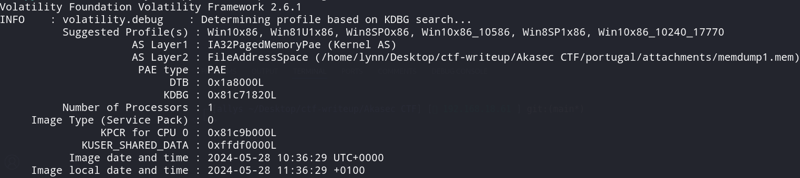
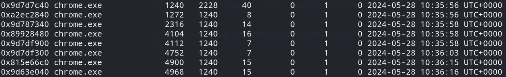
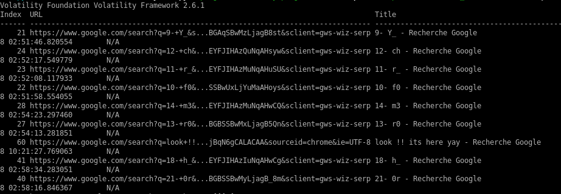

#  Portugal

> 
I accidentally left my computer unlocked at the coffee shop while I stepped away. I'm sure that someone took advantage of the opportunity and was searching for something.

> 
<a href="attachments/memdump1.mem">memdump1.mem</a>

## Path to Flag

Since this is a memory dump, I used volatility2 to analyze the memory. In this challenge, it is mainly about chrome history, where volatility itself has a <a href="https://github.com/superponible/volatility-plugins">plugin</a> built for chrome history.

Before going further, I decided to search the memory profile.

`vol.py -f memdump1.mem imageinfo`

 

After trying several profile, the best match is `Win10x86_10586`. Second thing to do is to find the detail about `chrome.exe` in the process list.

 

Since there is a built plugin for chrome history, we can directly use the plugin.

`vol.py --plugins=volatility-plugins -f memdump1.mem --profile=Win10x86_10586 chromehistory`

 

The interesting part is that the flag are scattered to several parts (on the title). One of the flag part is `11-r` which means that flag part 11 is the letter `r`. Therefore, I managed to arranged it manually.

`AKASEC{V0L4T1L1TY_f0r_chr0m3_s34rch_h1st0ry}`

