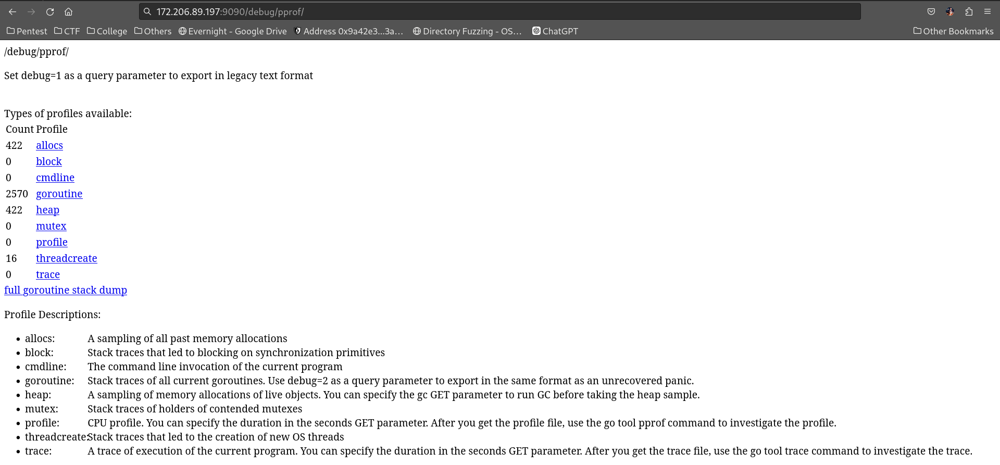

# Proxy For Life

> <p>Proxyying for life, IYKWIM</p>
> <p>And never forget: #FreePalestine 🇵🇸</p>
> <p><a href="attachments/attachments.zip"></a>attachments.zip</p>

## Path to Flag

Starting from the source code, there is the `flagHandler` function
```
func flagHandler(w http.ResponseWriter, r *http.Request) {
    args := os.Args
    flag := args[1]
    if 1 == 0 { // can you beat this :) !?
        fmt.Fprint(w, flag)
    } else {
        fmt.Fprint(w, "Nahhhhhhh")
    }
}
```
Seems like just an ordinary comparison operator, but move on to the bigger <i>picture</i>, which is the `indexHandler` function

```
func indexHandler(w http.ResponseWriter, r *http.Request) {
    if r.Method == http.MethodPost {
        config := safeurl.GetConfigBuilder().
            Build()

        client := safeurl.Client(config)

        url := r.FormValue("url")

        _, err := client.Get(url)
        if err != nil {
            renderTemplate(w, "index", map[string]string{"error": "The URL you entered is dangerous and not allowed."})
            fmt.Println(err)
            return
        }

        resp, err := http.Get(url)
        if err != nil {
            fmt.Println(err)
            return
        }
        defer resp.Body.Close()

        body, _ := io.ReadAll(resp.Body)
        renderTemplate(w, "index", map[string]interface{}{"result": template.HTML(body)})
        return
    }

    renderTemplate(w, "index", nil)
}
```

And surely, the main function, that calls all those functions
```
func main() {
    http.HandleFunc("/", indexHandler)
    http.HandleFunc("/flag", flagHandler)
    http.ListenAndServe(":1337", nil)
}
```

The first thought in mind is that, any random string will return `The URL you entered is dangerous and not allowed.` which seems to be caused by `safeURL`.

The second thing is that this kind of flaw, can't be exploited using SQLI, XSS, and any other common exploits. But, the only uncommon thing to be seen is the `net/http/` and `net/http/pprof` library. 

It turns out that library, that it added an endpoint `/debug/pprof`. After looking at the library documentation, it allows to execute cmdline.



It turns out that, we can just GET the endpoint `/debug/pprof/cmdline` and get the flag.

`AKASEC{r0t4t3d_p20x1n9_f002_11f3_15n7_92347_4f732_411____}`