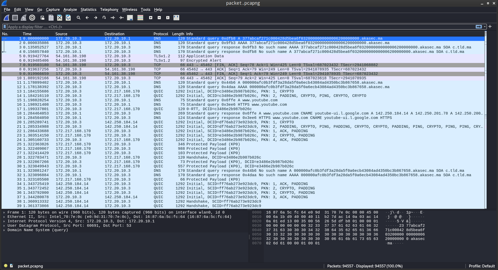
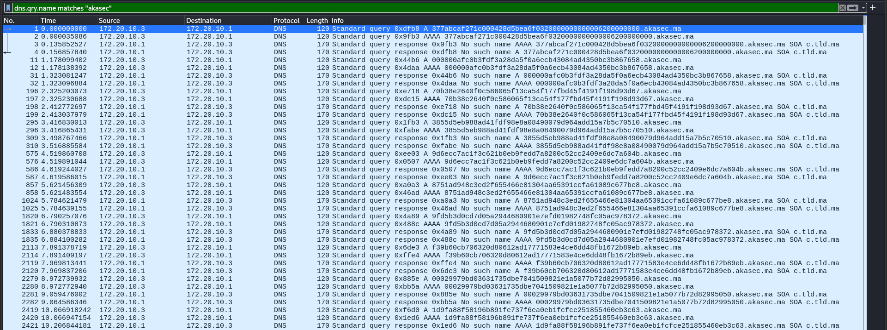
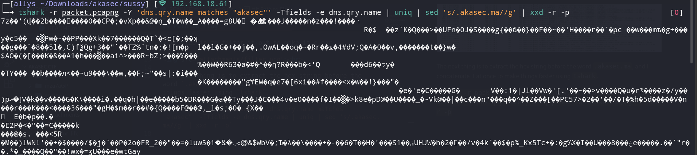
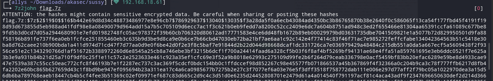
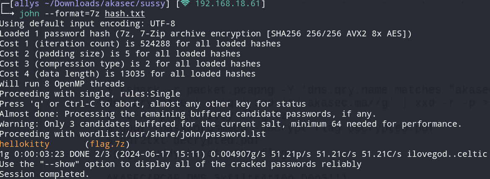
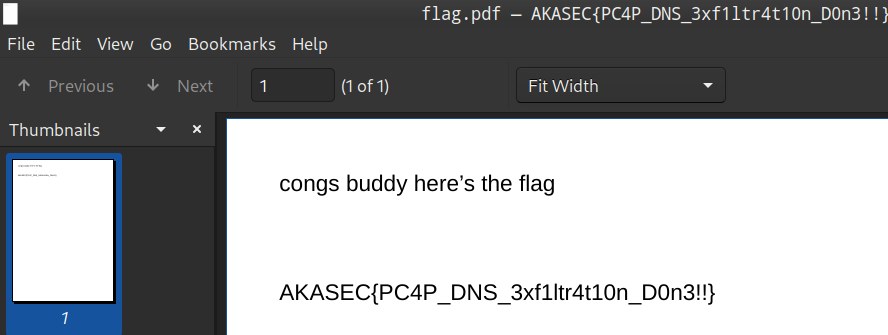

# Sussy

> <p>Something Fishy's Going on in Our Network</p>
> <p><a href="attachments/packet.pcapng"></a>packet.pcapng</p>

## Path to Flag
Start off with opening the pcap file, there are a lot of DNS protocol connections that has the word `akasec` on the info of each of the connection. That indicates that this challenge is about DNS exfiltration.

<br>

Next step is to filter it out to make it clear.

<br>

The next thing is to extract the hex string before the word `.akasec.ma`, and I concatenate it at once to make things faster using `tshark`.

`tshark -r packet.pcapng -Y 'dns.qry.name matches "akasec"' -Tfields -e dns.qry.name | uniq | sed 's/.akasec.ma//g' | xxd -r -p`

<br>

There are a lot of more details, but what's interesting here is that the hex string seems to look like a 7z file format, so I decided to save the decoded hex string to a 7z file.

`tshark -r packet.pcapng -Y 'dns.qry.name matches "akasec"' -Tfields -e dns.qry.name | uniq | sed 's/.akasec.ma//g' | xxd -r -p > flag.7z`

Unfortunately, the file is password-protected, so I used john to crack the password hash by using `7z2john` to get the password hash before cracking it.

Here is part of the hash

<br>

```
7z2john flag.7z > hash.txt
john --format=7z hash.txt
```

<br>

The password of the 7z file is `hellokitty`. So, just extract the file with that password using this command :  `7z x -phellokitty flag.7z`.

The file is a PDF file, but it's also password-protected.

```
pdf2john flag.pdf > hash_pdf.txt
john hash_pdf.txt
```

The password of the pdf file is `meow`. So, just open the PDF file with that password and the flag is there.

<br>

`AKASEC{PC4P_DNS_3xf1ltr4t10n_D0n3!!}`
