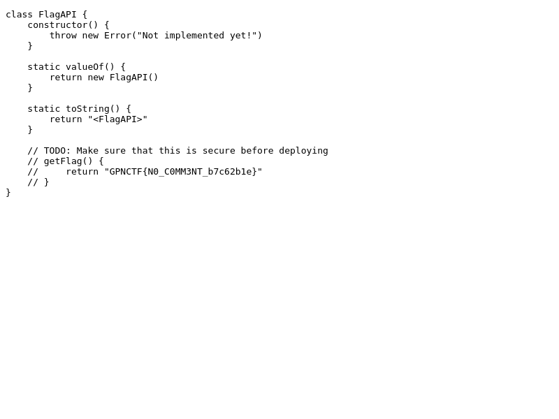

# todo

> 
I made a JS API! Sadly I had no time to finish it :(

> 
<a href="attachments/todo.tar.gz">todo.tar.gz</a>

## Path to Flag

In summary, we are given 2 important javascript file, which are `server.js` and `script.js`. the local `script.js` contains a fake flag, and we need to fetch the real script from the server.

Therefore, I exploited the input with XSS script and send it to /admin

``

Finally, the flag was successfully fetched

`GPNCTF{N0_C0MM3NT_b7c62b1e}`