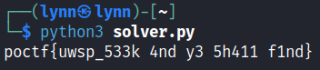

# A Pale, Violet Light

> <p>e= 5039 </p>
> <p>N = 34034827 </p>
> <p>C = 933969 15848125 24252056 5387227 5511551 10881790 3267174 14500698 28242580 933969 32093017 18035208 2594090 2594090 9122397 21290815 15930721 4502231 5173234 21290815 23241728 2594090 21290815 18035208 10891227 15930721 202434 202434 21290815 5511551 202434 4502231 5173234 25243036</p>

## Path to Flag

This objective of this challenge is to decrypt the ciphertext given that was encrypted using the RSA Algorithm

```
#! /usr/bin/python3

import math

e = 5039
N = 34034827
C = [933969, 15848125, 24252056, 5387227, 5511551, 10881790, 3267174, 14500698, 28242580, 933969, 32093017, 18035208, 2594090, 2594090, 9122397, 21290815, 15930721, 4502231, 5173234, 21290815, 23241728, 2594090, 21290815, 18035208, 10891227, 15930721, 202434, 202434, 21290815, 5511551, 202434, 4502231, 5173234, 25243036]

def mod_inv(e, phi):
    for d in range(2, phi):
        if (e * d) % phi == 1:
            return d
    return None

def calculate_phi(p, q):
    return (p - 1) * (q - 1)

p = 5807
q = 5861
phi = calculate_phi(p, q)
d = mod_inv(e, phi)

flag = ""
for c in C:
    m = pow(c, d, N)
    flag += chr(m)

print(flag)
```

This Python script is a basic RSA to decrypt the ciphertext. The function `mod_inv` was used to calculate modular inverse to find out the value of `d` as the `private key`. The function `calculate_phi` was used to calculate `phi` from the given value of `p` and `q`.



Replace blank spaces with underscore.

`poctf{uwsp_533k_4nd_y3_5h411_f1nd}`