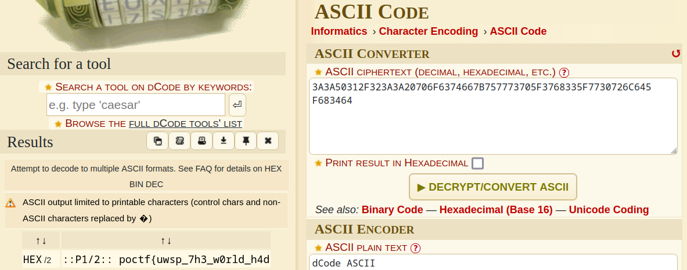
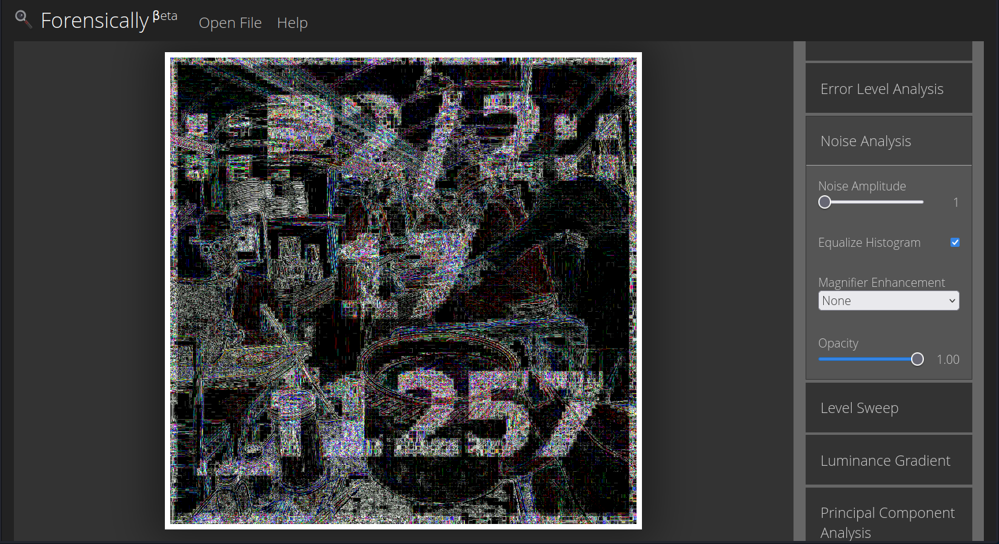

# A Petty Wage in Regret

> 
Here is a very interesting image. The flag has been broken up into several parts and embedded within it, so it will take a variety of skills to assemble it. 

> 
<a href="attachments/DF2.jpg">Download DF2.jpg</a>

## Path to Flag

I started of with analyzing the meta data using `exiftool` and found a suspicious set of string on the user comment

`3A3A50312F323A3A20706F6374667B757773705F3768335F7730726C645F683464`

I found out that it's encoded with the `ascii encoding`

The first part of the flag was obtained

`::P1/2:: poctf{uwsp_7h3_w0rld_h4d`

I tried to use an online photo forensic tool and found out the second part of the flag, but it's not clear enough so several attempt was made

`::P2/2::17_f1257`

`poctf{uwsp_7h3_w0rld_h4d_17_f1257}`