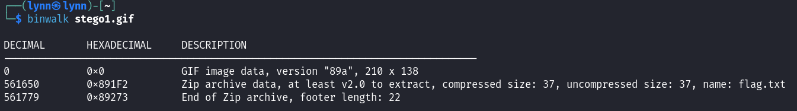
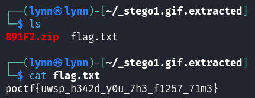

# Absence Makes Hearts Go Yonder

> 
Sometimes the oldest and simplest tricks can be the most fun. Here's an old stego tactic that requires no special software - just a little knowledge and maybe a keen eye.

> 

## Path to Flag

I started of with checking the metadata and found nothing, but found something hidden by using `binwalk`

Extract the hidden file and read the `flag`

`poctf{uwsp_h342d_y0u_7h3_f1257_71m3}`