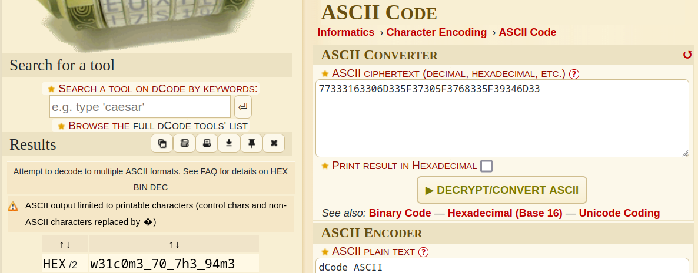

# If You Don't, Remember Me

> 
Here is a PDF file that seems to have some problems. I'm not sure what it used to be, but that's not important. I know it contains the flag, but I'm sure you can find it and drag it out of the file somehow. This is a two-step flag as you will find it partially encoded.

> 
<a href="attachments/DF1.pdf">Download DF1.pdf</a>

## Path to Flag

I started of with using the command `string` and got a suspicious string

`poctf(uwsp_77333163306D335F37305F3768335F39346D33}`

It seems to be partially encrypted by an encoding and found out that it was encoded with `ascii encoding`

`poctf(uwsp_w31c0m3_70_7h3_94m3}`