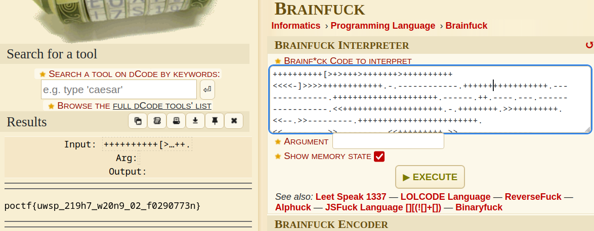

# Missing and Missed

> 
A little cerebral fornication to round out the crypto challenges. 

> 
++++++++++[>+>+++>+++++++>++++++++++<<<<-]>>>>++++++++++++.-.------------.+++++++++++++++++.--------------.+++++++++++++++++++++.------.++.----.---.-----------------.<<++++++++++++++++++++.-.++++++++.>>+++++++++.<<--.>>---------.++++++++++++++++++++++++.<<-----.--.>>---------.<<+++++++++.>>---------------.<<---------.++.>>.+++++++.<<--.++.+++++++.---------.+++++++..----.>>++++++++.+++++++++++++++.

## Path to Flag

This challenge gave a ciphertext-like character, so tried using `dcode.fr` to find out the encoding type and found out that the ciphertext given was a text encrypted using the `Brainfuck encoding'

`poctf{uwsp_219h7_w20n9_02_f0290773n}`