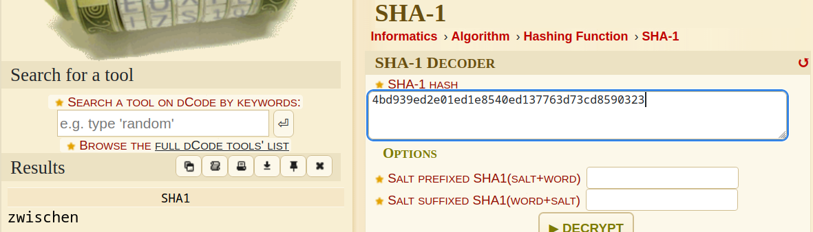

# The Gentle Rocking of the Sun

> 
Here's a password protected archive. Problem is that I seem to have forgotten das Passwort. All I have is this post-it note on my monitor that says "crack2 = 4bd939ed2e01ed1e8540ed137763d73cd8590323"

> 
<a href="attachments/crack2.7z">Download crack2.7z</a>

## Path to Flag

I thought that `4bd939ed2e01ed1e8540ed137763d73cd8590323` is an encoding, but it turns out to be a `SHA-1 Hash`

the password of the zipped file is `zwischen`

The zipped file contains nothink except a bunch of folders with no files, but the folder name is the key.
The final directory path is `/2023/p/o/c/t/f/{uwsp_/c/4/1/1/f/0/2/n/1/4_/d/2/3/4/m/1/n/9/}/`

`poctf{uwsp_c411f02n14_d234m1n9}`