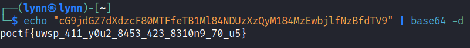

# Unquestioned and Unrestrained

> 
First crypto challenge so we have to keep it easy. Here's the flag, but it's encoded. All you have to do is figure out which method was used. Luckily, it's a common one.

> 
cG9jdGZ7dXdzcF80MTFfeTB1Ml84NDUzXzQyM184MzEwbjlfNzBfdTV9

## Path to Flag
Since it's a common encoding and the ciphertext met the requirement of `base64 encoding`
`echo "cG9jdGZ7dXdzcF80MTFfeTB1Ml84NDUzXzQyM184MzEwbjlfNzBfdTV9" | base64 -d`

`poctf{uwsp_411_y0u2_8453_423_8310n9_70_u5}`